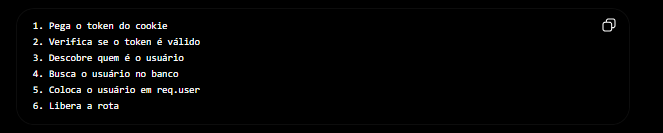
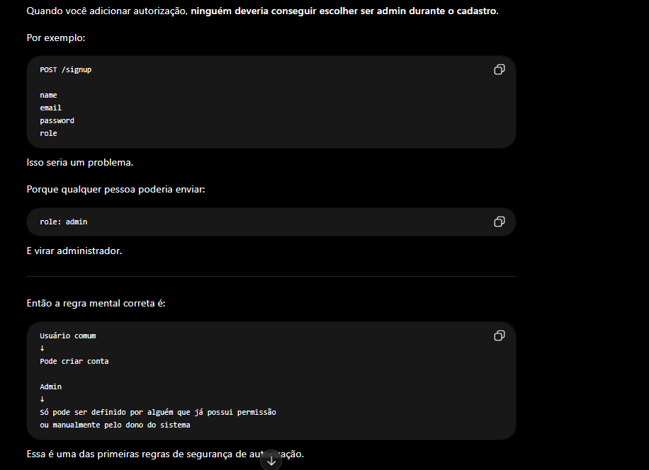

# `Libs Back End`

- 1 nodemon
- 2 bcryptjs
- 3 cookie-parser
- 4 crypto
- 5 dotenv
- 6 express
- 7 resend
- 8 jsonwebtoken
- 9 mongodb
- 10 mongoose
- 11 Zod

-------------------------------------------------------------------------------------------------

# `Libs Front End`

- 1 Axios
- 2 TailwindCSS
- 3 ShadcnUI

-------------------------------------------------------------------------------------------------

# `Resumo Inicial Back-End`

- 1  Instalar as dependencias
- 2  Iniciar o servidor no index.js com uma função assíncrona
- 3  Criar uma pasta db/connectDB.js para realizar a conexão com o mongoose e importar dentro da função assíncrona no index.js
- 4  Inicializar as rotas seguindo um padrão específico
  - Criar a pasta routes
  - Criar uma pasta para agrupar as rotas daquele módulo
  - Utilizar nomenclatura ex: auth.routes.js
  - Criar um index.js dentro de routes responsável por importar todas as rotas e definir um endpoint base
  - Importar todas as rotas agrupadas no index.js principal do projeto
- 5  Controllers são responsáveis pelas funções de cada rota
  - Criar a pasta controllers
  - Criar um arquivo para cada controller seguindo a nomenclatura ex: auth.controller.js
  - Importar as funções nas rotas
- 6  Models são responsáveis por definir a estrutura e regras dos dados no banco utilizando mongoose.Schema
  - Criar a pasta models
  - Criar um arquivo para cada model seguindo a nomenclatura ex: user.model.js
  - Definir campos, tipos, validações e valores padrões do schema
  - Exportar o model para ser utilizado nas controllers e services
  
-------------------------------------------------------------------------------------------------


# `Preparativos importantes para a criação de um usuario`

- 1  Receber as informações que vem do body da requisição
- 2  Fazer a validação dos dados
- 3  Conferir se esse usuario que esta tentando se cadastrar ja possui um email ativo = (usuario existente)
- 4  Criptografar a senha do usuario para não salvar ela de forma crua no banco de dados da aplicação / sempre quando for criar o user passar a senha com o hash
- 5  Com todas as informações em mãos criar um novo usuario no nosso banco de dados
- 6  `verificationToken` O back end gera um codigo de 6 digitos para o usuario fazer sua auth no seu email
- 7  utilizar o `await user.save()` para que todas nossas alterações sejam salvas no nosso banco MondoDB
- 8  Cuidar da parte do envio de email sendVerificationEmail, referente ao codigo de 6 digitos

-------------------------------------------------------------------------------------------------


# `JWT & COOKIES`

- 1  Criar no .env um JWT_SECRET
- 2  Dentro de utils criar uma função `generatetokenAndSetCookie`
- 3  Utilizar o método signin, passando o userId, o JWT_SECRETS e o expires_in
- 4  na resposta do back-end pro font ele vai salvar nos cookies do navegador uma chave chamada "token" com o valor token
- 5  Utilizando esses parametros para aumentar a segurança
```` 
    httpOnly: true,
    secure: ENV_VARIABLES.NODE_ENV !== 'development',
    sameSite: 'strict',
    maxAge: 7 * 24 * 60 * 60 * 1000, // 7 days
````

-------------------------------------------------------------------------------------------------


# `Envio de Emails`

- 1 Lib Resend
  - Resend emails: Plataforma de Entrega de Emails.
  - Criar uma pasta mail
    - email.js - `Responsável por enviar os emails utilizando o resend.`
    - emailTemplate.js - `Armazena os templates HTML dos emails da aplicação (verificação, reset de senha, etc).`
    - resend.config.js - `Configura a conexão com o resend e define o remetente padrão dos emails.`
- 2 Importa o código base gerado pela documentação do site
- No arqui email.js

-------------------------------------------------------------------------------------------------

# `Verify Email`

- 1 - Criar uma rota post verify-email
- 2 - Criar um controller para a rota `verifyEmail`
- 3 - Recebe o code de 6 digitos digitados pelo usuario no front
- 4 - Procura um usuário com esse código no banco.
- 5 - Verifica se o código ainda não expirou.
- 6 - Marca o email como verificado.
- 7 - Remove o código de verificação do banco
- 8 - Envia email de boas-vindas. Pela função `await sendWelcomeEmail(user.email, user.name)` passando o email e o name para o template
```
export const sendWelcomeEmail = async (email, name) => {

    try {
        const response = await resend.emails.send({
            from: ENV_VARIABLES.RESEND_DOMAIN,
            to: email,
            subject: "Welcome to our app!",
            html: `
                <h1>Welcome ${name}!</h1>
                <p>Thanks for joining Auth Company.</p>
            `,
        });
    } catch (error) {
        console.error("Error sending welcome email:", error);
        throw error;
    }
}
```

-------------------------------------------------------------------------------------------------

# `Forgot Password` 

- 1 - usuário digita o email
- 2 - backend procura o usuário
- 3 - backend gera um token aleatório
- 4 - salva esse token no banco com a lib crypto `crypto.randomBytes(20).toString("hex")`
- 5 - salva uma data de expiração `Date now() + 1 * 60 * 60 * 1000; // Set token to expire in 1 hour`
- 6 - envia email com link contendo o token
- 7 - depois o usuário usa esse token pra criar nova senha `await sendResetPasswordEmail(user.email, ${ENV_VARIABLES.CLIENT_URL}/reset-password/${resetToken});`
```
export const sendResetPasswordEmail = async (email, resetURL) => {

    try {
        const response = await resend.emails.send({
            from: ENV_VARIABLES.RESEND_DOMAIN,
            to: email,
            subject: "Reset your password",
            html: PASSWORD_RESET_REQUEST_TEMPLATE.replace("{resetURL}", resetURL),
        })
    } catch (error) {
        console.error("Error sending reset password email:", error);
        throw error;
    }
}
```

- 8 - O Uuário é redireciano para a web na tela de redefinição de senha após clicar no link do email de esqueceu a senha
- 9 - A URL sera dinamica domain/reset-password/token `Token gerado pela lib crypto const resetToken = crypto.randomBytes(20).toString('hex');`

-------------------------------------------------------------------------------------------------

# `Reset Password`

- 1 - Criar rota dinamica com o token `router.post('/reset-password/:token', resetPassword)`
- 2 - Recebe o token do params da url
- 3 - Recebe a nova senha do body
- 4 - Encontra o usuario vinculado ao token que quer redefinir a senha / faz a verificação
- 5 - Faz o hash com o bcrypt na nova senha escolhida pelo usuario
- 6 - Atribui a nova senha ao banco `user.password = hashedPassword;` 
- 7 - faz o reset `user.resetPasswordToken = undefined;` - `user.resetPasswordExpiresAt = undefined;`
- 8 - Salva as alterações no banco `await user.save()`
- 9 - Chama a função do resend para enviar um email ao usuario informando sobre a redefinição de senha ` await sendResetSuccessEmail(user.email);`
- 10 - Devolve a resposta da requisição com try catch `res.status(200).json({ success: true, message: "Password reset successfully" });` ou erro

-------------------------------------------------------------------------------------------------

# `Validação com Zod`

- 1 - Baixar a biblioteca Zod
- 2 - Criar uma pasta schema/userSchema
- 3 - Dentro de schema/userSchema criar os schemas registerSchema / loginSchema / verifyEmailSchema
- 4 - Criar um middleware validate
  ```
  export const validate = (schema) => (req, res, next) => {

    const result = schema.safeParse(req.body);

    if (!result.success) {
        return res.status(400).json({
            message: "Validation error",
            errors: result.error.errors.map((err) => ({
                field: err.path.join('.'),
                message: err.message
            }))
        })
    }

    req.body = result.data;
    next();
   }

  ```

- 5 - Chamar o middleware e o schema na rota
``` router.post("/signup", validate(registerSchema), signup); ```


-------------------------------------------------------------------------------------------------

# `Verificar Se Este Usuário Está Autenticado`

- 1 - Criar uma rota do tipo GET (`/check-auth`)
    - Essa rota será chamada quando o frontend abrir a aplicação.
    - Objetivo: verificar se o usuário continua autenticado.

- 2 - Passar o middleware `verifyToken`
    - Receber o token através dos cookies da requisição.
    - Verificar se o token existe.
    - Criar uma variável `decoded` utilizando:
      - `jwt.verify(token, JWT_SECRET)`
    - Verificar se o token é válido.
    - Verificar se existe `decoded.userId`.
    - Adicionar:
      - `req.userId = decoded.userId`
    - Chamar `next()` para continuar para o controller.

```

```

- 3 - Passar o controller `checkAuth`
    - Receber o `req.userId` vindo do middleware.
    - Dentro do bloco `try`.
    - Buscar o usuário no MongoDB:
      - `User.findById(req.userId)`
    - Verificar se o usuário ainda existe.
    - Se não existir:
      - Retornar erro de autenticação.
    - Se existir:
      - Retornar os dados do usuário sem a senha.
    - Resposta de sucesso:
      - Usuário autenticado.
      - Usuário ainda existe no banco.

- 4 - Fluxo completo
    - Usuário faz login.
    - JWT é salvo nos cookies.
    - Usuário fecha o navegador.
    - Usuário abre o site novamente.
    - Frontend chama:
      - `GET /check-auth`
    - Cookie é enviado automaticamente.
    - Middleware valida o JWT.
    - Controller busca o usuário no banco.
    - Se tudo estiver correto:
      - Retorna os dados do usuário.
    - Se algo estiver errado:
      - Retorna erro de autenticação.

- 5 - Objetivo desse endpoint
    - Persistência de autenticação.
    - Manter o usuário logado após atualizar a página.
    - Evitar que o usuário precise fazer login novamente toda vez que abrir o sistema.
    - Permitir que o frontend descubra se existe uma sessão válida antes de renderizar páginas protegidas.
  

-------------------------------------------------------------------------------------------------

# `SISTEMA DE AUTENTICAÇÃO - FLUXO MENTAL`

# `Signup`

- 1 - Recebe `name`, `email`, `password` e `confirmPassword` do body
- 2 - Verifica se todos os campos foram enviados
- 3 - Verifica se `password` e `confirmPassword` são iguais
- 4 - Busca no banco para verificar se já existe usuário com o mesmo e-mail
- 5 - Gera um código de verificação de 6 dígitos através da função `generateVerificationToken()`
- 6 - Faz o hash da senha utilizando bcrypt
- 7 - Cria um novo usuário no MongoDB
- 8 - Salva o código de verificação e sua data de expiração
- 9 - Salva o usuário no banco
- 10 - Gera um JWT através da função `generatetokenAndSetCookie()`
- 11 - Salva o JWT nos cookies
- 12 - Envia o e-mail contendo o código de verificação
- 13 - Retorna os dados do usuário sem a senha

# `Verify Email`

- 1 - Recebe o código de verificação enviado pelo usuário
- 2 - Busca um usuário com o mesmo código de verificação
- 3 - Verifica se o código ainda não expirou
- 4 - Caso não encontre retorna erro
- 5 - Define `user.isVerified = true`
- 6 - Remove `verificationToken`
- 7 - Remove `verificationTokenExpiresAt`
- 8 - Salva as alterações no banco
- 9 - Envia o e-mail de boas-vindas
- 10 - Retorna sucesso na verificação

# `Login`

- 1 - Recebe `email` e `password`
- 2 - Verifica se todos os campos foram enviados
- 3 - Busca usuário pelo e-mail
- 4 - Verifica se o usuário existe
- 5 - Compara a senha digitada com a senha criptografada usando bcrypt
- 6 - Verifica se a senha está correta
- 7 - Gera um JWT utilizando o ID do usuário
- 8 - Salva o JWT nos cookies
- 9 - Atualiza `lastLogin`
- 10 - Salva as alterações no banco
- 11 - Retorna os dados do usuário sem a senha

# `Logout`

- 1 - Recebe a requisição de logout
- 2 - Remove o cookie `token`
- 3 - Retorna sucesso para o frontend
- 4 - Usuário deixa de estar autenticado

# `Forgot Password`

- 1 - Recebe o e-mail do usuário
- 2 - Busca usuário pelo e-mail
- 3 - Verifica se o usuário existe
- 4 - Gera um token aleatório utilizando `crypto.randomBytes`
- 5 - Define uma data de expiração para o token
- 6 - Salva `resetPasswordToken`
- 7 - Salva `resetPasswordExpiresAt`
- 8 - Salva as alterações no banco
- 9 - Envia um e-mail contendo o link de redefinição de senha
- 10 - Retorna sucesso


# `Reset Password`

- 1 - Criar rota dinâmica com o token `router.post('/reset-password/:token', resetPassword)`
- 2 - Recebe o token do params da URL
- 3 - Recebe a nova senha do body
- 4 - Encontra o usuário vinculado ao token que quer redefinir a senha
- 5 - Verifica se o token ainda não expirou
- 6 - Faz o hash com bcrypt na nova senha escolhida pelo usuário
- 7 - Atribui a nova senha ao banco
- 8 - Remove `resetPasswordToken`
- 9 - Remove `resetPasswordExpiresAt`
- 10 - Salva as alterações no banco
- 11 - Envia e-mail informando que a senha foi alterada com sucesso
- 12 - Retorna sucesso ou erro utilizando try catch


# `Check Auth`

- 1 - Criar uma rota protegida do tipo GET `/check-auth`
- 2 - Adicionar o middleware `verifyToken` antes do controller
- 3 - Middleware recebe o token através dos cookies da requisição
- 4 - Verifica se o token existe
- 5 - Utiliza `jwt.verify(token, JWT_SECRET)` para validar e decodificar o JWT
- 6 - Verifica se o token é válido e se retornou o objeto `decoded`
- 7 - Obtém o ID do usuário através de `decoded.userId`
- 8 - Adiciona o ID na requisição `req.userId = decoded.userId`
- 9 - Chama `next()` para liberar acesso ao controller
- 10 - Controller recebe o ID através de `req.userId`
- 11 - Busca o usuário no MongoDB utilizando `User.findById(req.userId)`
- 12 - Verifica se o usuário ainda existe no banco
- 13 - Caso não exista retorna `401 Unauthorized`
- 14 - Caso exista retorna os dados do usuário sem a senha utilizando `userNotPassword(user)`
- 15 - Devolve a resposta da requisição com try catch `res.status(200).json({ success: true, message: "User is authenticated", data: userNotPassword(user) })`


# `Autorização`

- O que é Autorização?
  - Autorização responde a pergunta: / O que este usuário pode fazer? /  Enquanto autenticação responde: Quem é este usuário?
  
- O que é uma permissão? - Exemplo para o Kotoba 
  - Usuário comum
```
Pode: ✅

Criar palavras
Criar frases
Editar suas próprias palavras
Editar suas próprias frases

Não Pode: ❌

Ver dashboard admin
Excluir usuários
```

  - Usuário Admin
```
Pode: ✅

Criar palavras
Criar frases
Editar qualquer conteúdo
Excluir qualquer conteúdo
Gerenciar usuários
Acessar dashboard admin
```


```
Request

verifyToken

Usuário identificado

Busca usuário no banco

Role encontrada

role = admin

Acesso permitido

Controller executa
```

- O objetivo da autorização não é: `Descobrir quem é o usuário` Isso a autenticação já fez.
  - O objetivo é: `Verificar se ele possui a permissão necessária`

```
O verdadeiro papel da Role
Muita gente pensa:
Role = admin

Mas na verdade é:
Role
↓
Conjunto de permissões

Exemplo:

Admin

Pode:
- Gerenciar usuários
- Gerenciar conteúdo
- Ver estatísticas
```



- 1 - Adicionar o campo `role` no model User
- 2 - Definir o valor padrão como `"user"`
- 3 - Restringir os valores possíveis utilizando `enum: ["user", "admin"]`
- 4 - Criar o middleware `verifyToken`
- 5 - Middleware recebe o token através dos cookies da requisição
- 6 - Verifica se o token existe
- 7 - Utiliza `jwt.verify(token, JWT_SECRET)` para validar e decodificar o JWT
- 8 - Verifica se o token é válido e se retornou o objeto `decoded`
- 9 - Obtém o ID do usuário através de `decoded.userId`
- 10 - Busca o usuário no MongoDB utilizando `User.findById(decoded.userId)`
- 11 - Verifica se o usuário ainda existe no banco
- 12 - Remove informações sensíveis utilizando `userNotPassword(user)`
- 13 - Adiciona os dados do usuário na requisição `req.user = userNotPassword(user)`
- 14 - Chama `next()` para liberar acesso ao próximo middleware
- 15 - Criar o middleware `isAdmin`
- 16 - Middleware recebe os dados do usuário através de `req.user`
- 17 - Verifica se o usuário possui a role `"admin"`
- 18 - Caso a role seja diferente de `"admin"` retorna `403 Forbidden`
- 19 - Caso a role seja `"admin"` chama `next()`
- 20 - Criar uma rota protegida de teste GET `/test-admin`
- 21 - Adicionar os middlewares na ordem `verifyToken, isAdmin`
- 22 - Requisição chega primeiro no `verifyToken`
- 23 - Usuário é autenticado através do JWT
- 24 - Dados do usuário são adicionados em `req.user`
- 25 - Requisição segue para o middleware `isAdmin`
- 26 - Middleware verifica `req.user.role`
- 27 - Caso seja `"admin"` libera acesso ao controller
- 28 - Controller executa normalmente
- 29 - Retorna `200 OK`
- 30 - Resposta confirma que o usuário possui permissão para acessar recursos administrativos

-------------------------------------------------------------------------------------------------

`O que o usuário faz depois de logar?`

- O usuário cadastra:
  - Palavras
  - Frases
  - Kanjis

-------------------------------------------------------------------------------------------------


# `Cadastro de palavras - Words`

- 1 - Criar o model words.js
- 2 - Criar o Schema com o Zod para a validação dos dados vindo do body, utilizando em conjunto com o middlleware validate
- 3 - Organizar a estrutura de arquivos e pastas na aplicação para receber as rotas e controllers na arquitetura correta, tudo no seu devido lugar
- 4 - Criar as rotas de Words
- 5 - Criar os Controllers de Words

- `Aprendizado`
  - `1` Quando for Atualizar uma rota dentro do seu CRUD utilizando o mongoDB com mongoose no lugar do `{new: true}` mudar para `{ returnDocument: "after" }`, eles messmo indicam a mudança para nova versão
  - `2` Para garantir que um usuário só possa acessar, editar ou excluir os próprios dados, utilizar filtros combinando o ID do documento com o ID do usuário autenticado.

```
Exemplo:

{
    _id: id,
    user: req.user._id
}
```

  - Isso faz o MongoDB procurar apenas documentos que pertençam ao usuário logado, aumentando a segurança da 
  - `3` O método populate() permite buscar dados relacionados de outra coleção utilizando um campo com ref.
```
Exemplo:

Word.find()
    .populate("user", "name email")

Nesse caso o Mongoose substitui automaticamente o ObjectId armazenado em "user" pelos dados do usuário, retornando apenas os campos "name" e "email".

Sem populate:

{
    "user": "6a24c830a12abbd97773970b"
}

Com populate:

{
    "user": {
        "name": "Marcos",
        "email": "alexandre020602@gmail.com"
    }
}

Muito útil para áreas administrativas, relatórios e relacionamentos entre coleções.
```


- `4` O operador $or
    - Uma das condições abaixo precisa ser verdadeira
    - japanese combina OU meaning combina

- `5` O que é $regex?
     - Regex significa: / Expressão regular
     - Mas aqui você está usando da forma mais simples:
     - `$regex: query`
     - Se:
          - query = "com"
          - ele encontra:
          - Comer / comer / COMER / comida dependendo da configuração.

- `6` O que é $options: "i"?
     - Ignorar maiúsculas e minúsculas


```
Pegue todas as palavras

que pertencem ao usuário logado

E

onde o japonês contenha o texto pesquisado

OU

onde o significado contenha o texto pesquisado

```

reviewCount = 0
→ Nunca revisada

reviewCount = 1~4
→ Em aprendizado

reviewCount >= 5
→ Aprendidas

```
PUT
↓
Editar vários campos do recurso

PATCH
↓
Editar um estado ou poucos campos específicos
```